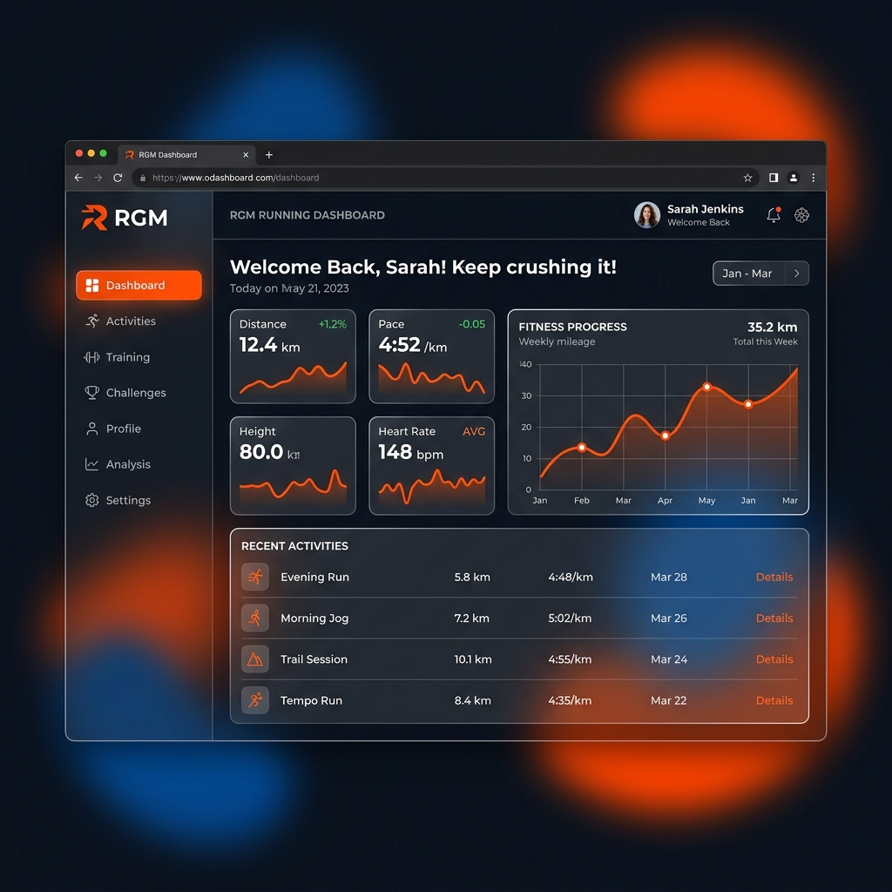
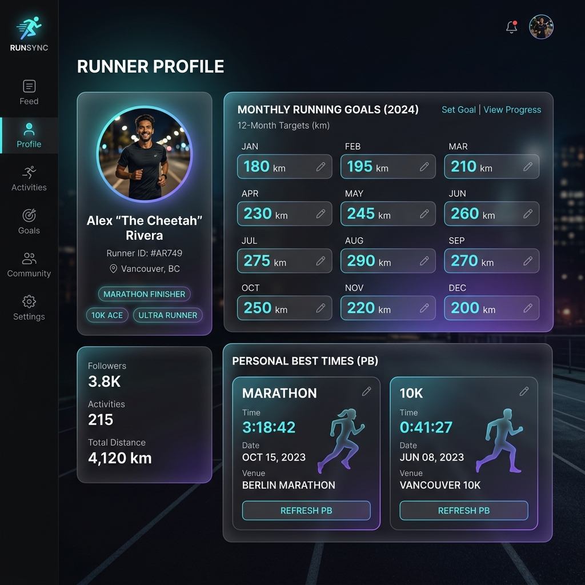
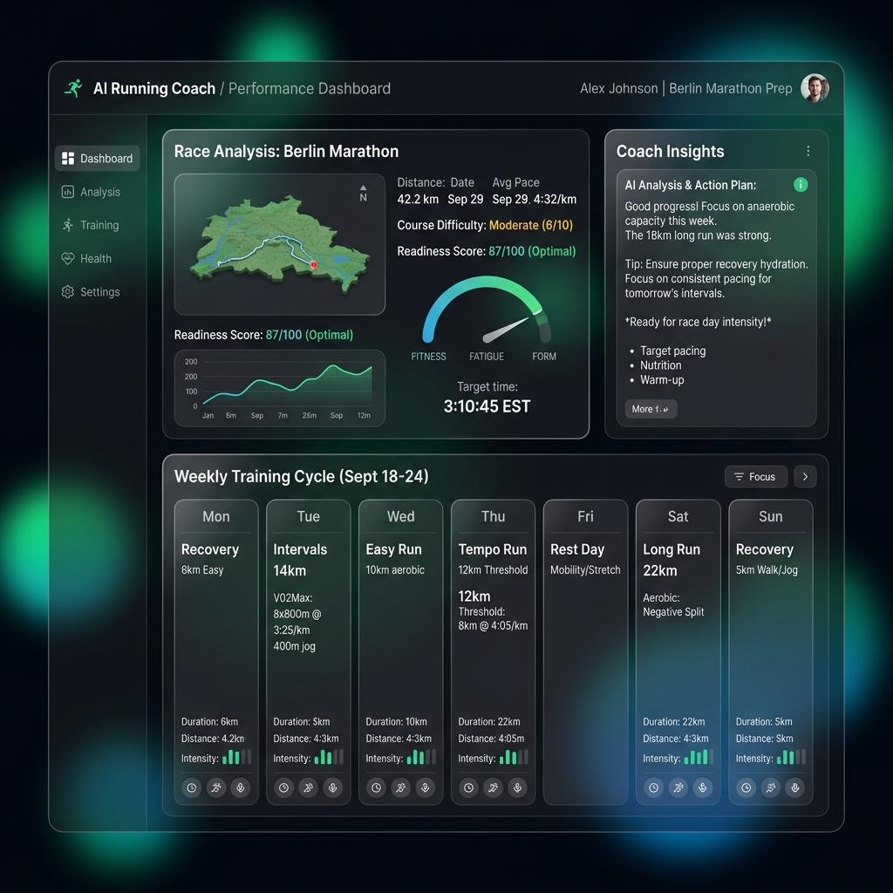
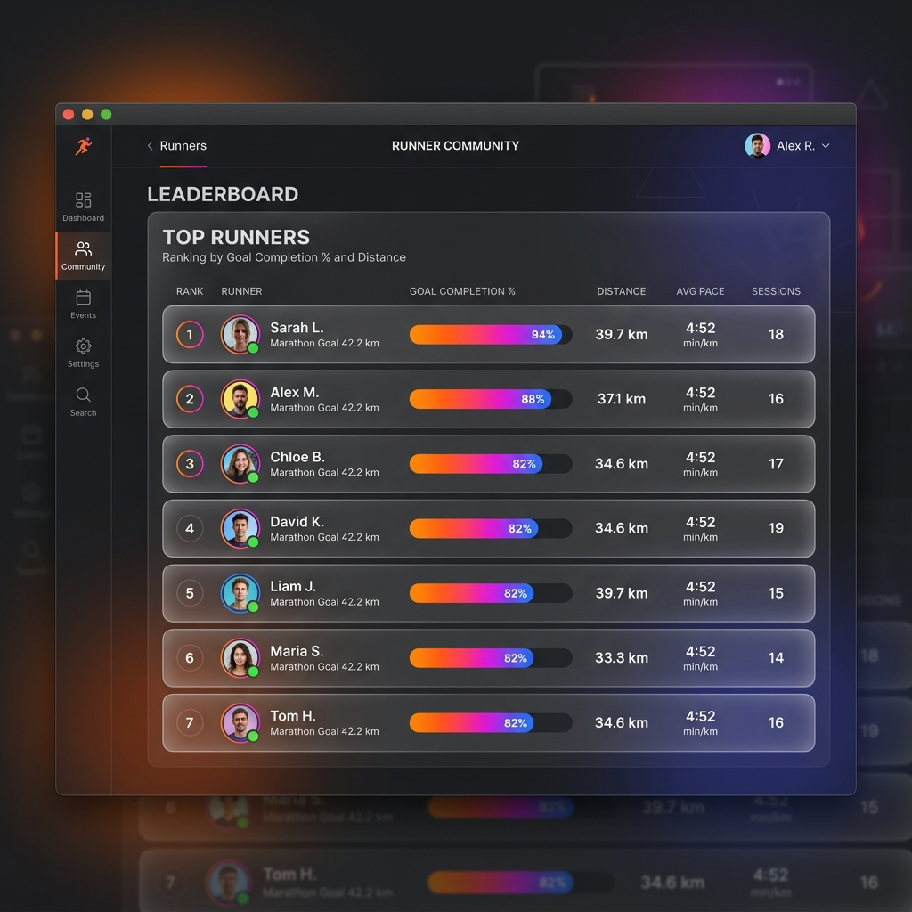

# RGM (跑团管理平台) User Manual

欢迎使用 **RGM (Running Community Manager)**！本手册将帮助您快速了解和使用平台的核心功能。

RGM 是一个专为跑团打造的一站式管理平台。通过连接 Strava，系统能够自动同步您的跑步数据，进行 AI 智能分析，并参与团队内部的排行榜竞争。

---

## 1. 快速入门

### 1.1 账号注册与登录
1. 访问平台主页。
2. 点击 **"登录 / 注册"**。
3. 您可以选择以下两种方式登录：
   - **邮箱登录/注册**：推荐方式。输入邮箱和密码，首次输入即为注册。
   - **Google 账号登录**：点击 Google 图标进行一键登录（需要科学上网）。
   *注意：登录前请确保勾选“同意个人数据声明”。*

### 1.2 连接 Strava
为了使平台能够获取您的跑步数据，您必须连接 Strava 账号：
1. 登录后，在首页或 Dashboard 点击 **"连接 Strava"**。
2. 系统将跳转至 Strava 授权页面。
3. 登录您的 Strava 账号并同意授权。
4. 授权成功后，您将返回 RGM 平台，并看到“Strava 已连接 ✓”。

---

## 2. 核心功能介绍

### 2.1 Dashboard (数据面板)

Dashboard 是您的个人控制台，集中展示了您最近的跑步状态：
- **Running Stats**：展示本月/本周的跑量、配速、时长等关键数据。
- **Fitness Chart (体能趋势)**：可视化您的体能增长与疲劳程度。
- **Leaderboard (排行榜)**：展示您在跑团中的排名（按目标完成率或跑量排序）。
- **活动列表**：按月份查看所有的跑步记录历史。

### 2.2 跑者档案与目标设定 (Profile)

点击顶部的导航栏进入 **跑者档案** 页面（Profile）。
- **跑者信息**：填写身高、体重、跑龄、性别等基本信息。
- **自定义头像**：您可以上传本地图片作为自定义头像，否则默认使用 Strava 头像。
- **比赛计划**：添加您即将参加的比赛（如 10K、半马、全马或越野赛），AI 教练将根据比赛日期为您提供冲刺或调整建议。
- **个人最佳成绩 (PB)**：点击“从 Strava 导入”即可自动计算并导入您的最佳成绩记录，也可以手动修改。
- **目标设定**：
  - **跑量目标**：设置您的“每周”或“每月”跑量目标（km）。
  - **每月独立目标**：如果您选择“每月”，可以展开按月份独立设置不同的目标距离。
  - **生理参数**：填写最大心率和静息心率，以获得更精确的训练状态计算。
- **通知配置**：支持配置 Discord Webhook 或 企业微信机器人 Webhook，在同步到新数据或生成周报时自动发送通知。
*(请记得点击页面底部或顶部的“保存档案”按钮)*

### 2.3 AI 教练 (Coach)

AI 教练以世界级马拉松教练 **Renato Canova** 的训练哲学为核心，为您提供专业的指导。
- **智能分析**：在“AI 教练”页面，点击“同步数据并刷新分析”。
- AI 将根据您最近的跑步记录、当前体能、设定的比赛计划（尤其是专项性训练），生成：
  - **体能差距评估**
  - **核心训练原则**
  - **本周重点建议**
  - **周期性训练规划**（如储备期、关键期等）

### 2.4 深度分析 (Analysis)
该页面提供长周期的深度数据挖掘：
- **体能趋势 (CTL/ATL/TSB)**：查看您的长期体能负荷。
- **跑力诊断 (VDOT)**：基于最近的成绩预测您的各项能力。
- **月度统计与目标回顾**：查看您全年的跑量完成情况。

### 2.5 团队功能 (Team) 与排行榜

与跑友们组建团队，共同挑战：
- **创建团队**：输入团队名称即可创建一个新团队，系统会生成一个专属的 **6位邀请码**。
- **加入团队**：输入其他跑友分享的 6位邀请码 即可加入他们的团队。
- **团队面板**：进入特定团队后，可以查看团队总跑量、团队成员列表及内部排行榜。

---

## 3. 常见问题 (FAQ)

**Q: 为什么我的跑步数据没有更新？**
A: 数据会在后台每天自动同步。如果您刚刚完成跑步，可以前往“AI 教练”页面点击“同步数据并刷新分析”来手动触发即时同步。

**Q: 如何获取 Discord / 企业微信 Webhook？**
A: 
- **Discord**: 在频道设置 -> 整合 -> Webhook 中创建并复制 URL。
- **企业微信**: 在群聊 -> 添加群机器人中创建并复制 Webhook URL。
将 URL 填入您的 Profile 页面并保存即可。

**Q: 排行榜是如何排序的？**
A: 默认按照**“目标完成率”**排序（即：当前跑量 / 设定的目标跑量）。您也可以在排行榜页面右上角切换为按**“跑量 (km)”**绝对值排序。

**Q: AI 教练提到的“专项能力”是什么？**
A: AI 教练遵循 Renato Canova 的训练理念，强调“专项性（Specificity）”。即训练配速和环境应当无限接近您目标比赛的要求（如全马配速的95%-105%）。单纯的慢跑（LSD）只是基础，专项能力才是比赛的关键。

---
*RGM 平台 - 记录. 竞争. 进化.*
